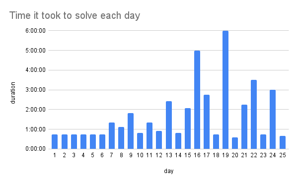
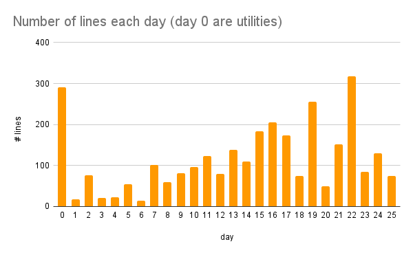
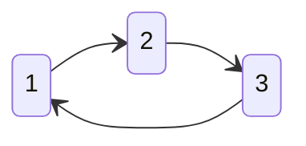
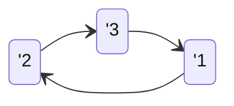
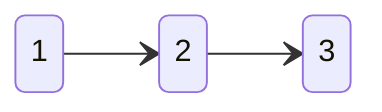
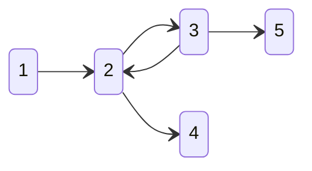
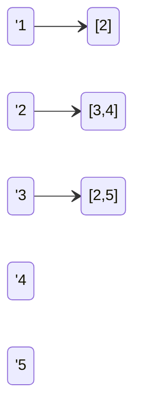
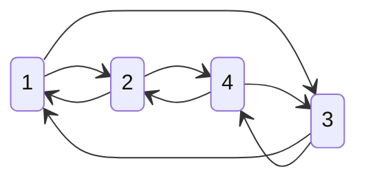

# Advent of code 2022 POV

Colloquium notes.

### Contents

1. about AoC 2022
   - what is it
   - statistics
2. used algorithms
    - graph theory basics (theory)
    - state representation (Python)
    - complexity theory basics (theory)
    - data structures (theory) (Python)
    - basic searches (theory) (Python)
      - BFS, DFS
    - shortest paths (theory) (Python)
      - Floyd-Warshall, Dijkstra
    - planning (theory) (Python)
      - BFS, DFS, A*
3. solving & coding process
   - solving process
   - libs used
   - my personal lib
   - test-driven-development
   - f-strings

             

## About AoC 2022

- series of `25` daily challenges
  - each has 2 parts
- programming language independent
  - **Python**, JS (TS), Rust, (Excel)
- difficulty increases with each task *

- _Type 2 fun_
- task categories
  1. rule-based logic implementation
  2. basic data aggregations
  3. 2D grid based searches (maze solving)
  4. discrete math (number theory)
  5. simulations (rule-based logic in time)
  6. 2D vector math
  7. recursive tasks (trees)
  8. 3D grid based searches (maze solving in time)
  9. combinatorial optimization

             

## Used algorithms
Attention, a bit of theory ahead.

### Graph theory basics

Mathematical graph (aka Network):
$$ G = (V, E) $$
$$ V = \{1, ..., n\} $$

with undirected edges
$$ E = \{\{x, y\} \mid x,y \in V \land x \not = y \} $$

with directed edges
$$ E = \{(x, y) \mid x,y \in V \land x \not = y \} $$

path (oriented) (of length `2`)

cycle (oriented) (of length `3`)

             

### Representation
general graph representations

Matrix (`list[list[int]]`)
| v_id | 1   | 2   | 3   | 4   | 5   |
| ---- | --- | --- | --- | --- | --- |
| 1    | -   | 1   | -   | -   | -   |
| 2    | -   | -   | 1   | 1   | -   |
| 3    | -   | 1   | -   | -   | -   |
| 4    | -   | -   | -   | -   | -   |
| 5    | -   | -   | -   | -   | -   |

Linked list (`dict[int, list[int]]`)

Special case (2D grid)

Matrix (`list[list[int]]`)
| 1   | 2   |
| --- | --- |
| 3   | 4   |

             

### Complexity theory

Big-O notation:

$$ f(n) = \mathcal{O}(g(n)) $$

$$ \exists n_0, c: f(n) \le c \cdot g(n) \mid \forall n \ge n_0, c \in \mathbb{R} $$

Examples:

$$ f(n) = 3n + 5 $$
$$ g(n) = 4n^2 $$
$$ h(n) = n - 2 $$

---

$$ f(n) = \mathcal{O}(g(n)) $$
$$ h(n) = \mathcal{O}(g(n)) $$
$$ f(n) = \mathcal{O}(h(n)) $$
$$ h(n) = \mathcal{O}(f(n)) $$

             

Back to our representations

Matrix (`list[list[int]]`)
| v_id | 1   | 2   | 3   | 4   | 5   |
| ---- | --- | --- | --- | --- | --- |
| 1    | -   | 1   | -   | -   | -   |
| 2    | -   | -   | 1   | 1   | -   |
| 3    | -   | 1   | -   | -   | -   |
| 4    | -   | -   | -   | -   | -   |
| 5    | -   | -   | -   | -   | -   |

$$ \textnormal{is }u\textnormal{ a neighbor of }v\textnormal{: } \mathcal{O}(1)$$
$$ \textnormal{get all neighbors of }u\textnormal{: } \mathcal{O}(n)$$

Linked list (`dict[int, list[int]]`)

$$ \textnormal{is }u\textnormal{ a neighbor of }v\textnormal{: } \mathcal{O}(n)$$
$$ \textnormal{get all neighbors of }u\textnormal{: } \mathcal{O}(1)$$

Special case (2D grid) (`list[list[int]]`)
| 1   | 2   |
| --- | --- |
| 3   | 4   |

$$ \textnormal{is }u\textnormal{ a neighbor of }v\textnormal{: } \mathcal{O}(1)$$
$$ \textnormal{get all neighbors of }u\textnormal{: } \mathcal{O}(1)$$

             

### Data structures

**random access array**

used by `list` and `tuple`

   - get item at index: $\mathcal{O}(1)$
   - append item: $\mathcal{O}^*(1)$
   - insert item: $\mathcal{O}(n)$
   - find item: $\mathcal{O}(n)$

**hash set**

([viz](https://www.cs.usfca.edu/~galles/visualization/OpenHash.html))
used by `dict` and `set`

   
   - has key: $\mathcal{O}(h(k))^*$
   - add key: $\mathcal{O}(h(k))^*$
   - remove key: $\mathcal{O}(h(k))^*$

