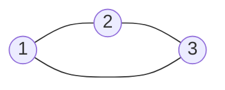
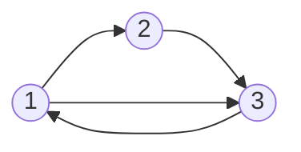
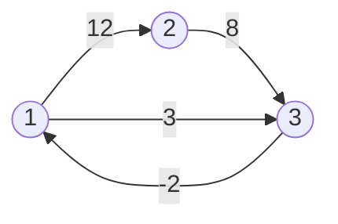
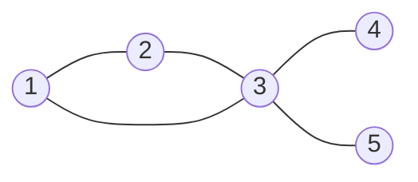

### Advent of code

---

- series of `25` daily challenges

- each has 2 parts

- programming language independent

- **Python**, JS (TS), Rust, (Excel)

- difficulty increases with each task *

---
<!-- slide style="font-size: 0.8em" -->
### Categories of tasks

1. rule-based logic implementation
2. basic data aggregations
3. grid-based searches (maze solving)
4. discrete math (number theory)
5. simulations (rule-based logic in time)
6. 2D vector math
7. recursive tasks (trees)
8. combinatorial optimization

---

### 1. rule-based logic
🪨 🗞 ✂

---

### 2. basic data aggregations

```
17998
7761 
	=> 25759

5628
5199
2129 
	=> 12956 => min

6451
5761
3736
3020 
	=> 18968
```

---

### 3. grid-based searches

```
...........#.....##.
..##........#...#...
.......Sv...#>>>>v..
.....##.>>v#.^.#.v..
.....#...#>>>>.#.G..
..............#.....
```
<!-- element style="font-size: 24px" align="justify" -->

---

### 4. discrete math (number theory)

➗?

mod

---

### 5. Simulations


---

### 6. 2D vector math

$$
y = ax + c
$$

$$
y = bx + d
$$

intersection point of two lines:

$$
P = (\frac{d-c}{a-b}, a\frac{d-c}{a-b} + c)
$$

---

### 7. Recursive tasks
![[https://media1.giphy.com/media/xThuWu82QD3pj4wvEQ/giphy.gif?cid=ecf05e47ej84jxvcbzwg0akdnmdemsdz3xw0roeemc4vnxi5&ep=v1_gifs_search&rid=giphy.gif&ct=g]]

---

### 8. Combinatorial optimization

![[https://miro.medium.com/v2/resize:fit:960/1*8E1IXIeenRw8x1TF_-hruQ.gif]]
![[https://i.giphy.com/media/vSkXRfZ9mjNQY/giphy.webp]]


---

## Shortest path problem

---

Why this problem?

---

3. grid-based searches (maze solving)
7. recursive tasks (trees)
8. combinatorial optimization

---

### Graph theory basics

---

Mathematical graph (aka Network):

$$ G = (V, E) $$
$$ V = \{1, ..., n\} $$

with undirected edges

$$ E = \{\{x, y\} \mid x,y \in V \land x \not = y \} $$

with directed edges

$$ E = \{(x, y) \mid x,y \in V \land x \not = y \} $$

---




---

Weighted graph

$$ w: E \rightarrow \mathbb{R} $$




---

Adjacency matrix


|   | 1   | 2   | 3 |
|---|-----|-----|---|
| 1 | 0   | 12  | 3 |
| 2 | inf | 0   | 8 |
| 3 | -2  | inf | 0 |
<!-- element style="font-size: 0.5em" -->

---

 List of neighbours


```python
{
	1: [(2, 12), (3, 3)],
	2: [(3, 8)],
	3: [(1, -2)],
}
```

---

A path

$$ P = (v_1, v_2, ..., v_n) $$

$$ v_i \in V $$

$$ (v_i, v_{i+1}) \in E $$

$$ i \neq j \mid \forall i,j \in \{1, ..., n\}   $$

$$ |P| := n - 1 $$

---



Path from _1_ to _4_?

---


$$P = (1, 3, 4) $$

$$ |P| = 2 $$

---

How do you find it?

---

#### Depth-first search

---

#### Depth-first search
Is it sound?

---

Is it sound?
- each vertex is visited at most once
- the whole reachable part of the graph will be visited

---

Is it fast?

---

### _Asymptotic complexity_

![[complexity.png]]

---


$$ f(n) \in \mathcal{O}(g(n)) $$

$$ \exists c \in \mathbb{R}, \exists n_0 \in \mathbb{N}: $$

$$\forall n \in \mathbb{N}: n > n_0: c \cdot f(n) \le g(n) $$


---

- $$ \mathcal{O}(n): $$ read a book
- $$ \mathcal{O}(n!): $$ shuffle a deck of cards into all possible variations  
- $$ \mathcal{O}(\log n): $$ find a word in a dictionary
- $$ \mathcal{O}(1): $$ what's your name?

---

#### Depth-first search
Is it fast?

---

#### Depth-first search

Worst case complexity

$$ \mathcal{O}(|V| + |E|) $$

Every vertex and every edge may be visited

---

#### Breadth-first search

---

#### Breadth-first search
Is it sound?

---

#### Breadth-first search
Is it fast?

---

#### Breadth-first search

Worst case complexity

$$ \mathcal{O}(|V| + |E|) $$

Every vertex and every edge may be visited

---

What about weighted edges?


---

#### Dijkstra's algorithm

---

#### Dijkstra's algorithm

Worst case complexity

$$ \mathcal{O}(|E| \cdot T_{dk} + |V| \cdot T_{em}) $$

Using binary heap

$$ \mathcal{O}((|E| + |V|) \log |V|) $$

---

What about larger graphs?

---

Planning
- state space + expanding function
- initial state
- one or more goal states
---

Search in a state space

---

Can we go faster?

---

#### Heuristic algorithms

---

True weight

$$ w: E \rightarrow \mathbb{R} $$

Heuristic estimate

$$ h: V \rightarrow \mathbb{R} $$

---

Goal-awareness

$$ h(v_g) = 0 $$

Consistency

$$ h(v_g) = 0 $$

$$ h(v_s) \le w((v_p, v_s)) + h(v_p) $$

---

Admissibility

$$ h(v) \le g_{true}(v) \mid \forall v \in V $$

$$ g_{true}(v) := $$ the true length of the shortest path 

from $$v$$ to goal

---

#### A Star

$$ f_{score} = g_{score}(v) + h(v) $$

$$ g_{score}(v) := $$ length of the shortest path 

from start to $$v$$ so far

---

A Star finds optimal path $$ \leftrightarrow $$ heuristic is admissible

---

### AoC 2022

---

![[duration_plot.png]]

---

![[duration_plot.png]]
![[lines_plot.png]]

---

### What made me faster?

---
1. write trivial tests first

```python
def test_parse() -> None:
	points = list(parse(load_stripped_lines("inputs/18_0")))
	assert len(points) == 13
	assert points[0] == Point3(2, 2, 2)
	assert points[-1] == Point3(2, 3, 5)
```

```python
if __name__ == "__main__":
	test_parse()
	assert solve_first("inputs/18_0") == 64
	assert solve_second("inputs/18_0") == 58
	print(solve_second("inputs/18_1"))
```

---
<!-- slide style="font-size: 0.7em" -->

2. top-down approach is faster

```python
def shortest_path(start: Point2, goal: Point2, grid: Grid2) -> list[Point2]:
	...
```

---

3. writing code is fast, debugging is slow

- mypy
- black
- pytest

---

4. start by solving the task on paper

---

5. do not repeat yourself

---

1. write trivial tests first
2. top-down approach is faster
3. writing code is fast, debugging is slow
4. start by solving the task on paper
5. do not repeat yourself

---

### Takeaways

---
<!-- slide style="font-size: 0.8em" -->

- fun
- challenge
- some confidence with Python
- re-visit of entry-level math and algorithmization

---

### AoC 2023

---
<!-- slide style="font-size: 0.7em" -->

- RAI private group
- daily rewards for the first three gold-star solutions
- cake for the most collected stars on 1.1.2024 at 00:00
- weekly 30 minute code review of one chosen task
