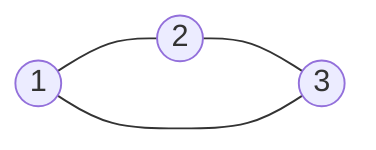
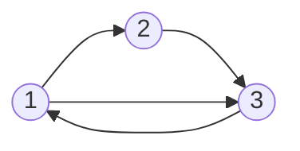

### Graph theory basics

---

Mathematical graph (aka Network):

$$ G = (V, E) $$
$$ V = \{1, ..., n\} $$

with undirected edges

$$ E = \{\{x, y\} \mid x,y \in V \land x \not = y \} $$

with directed edges

$$ E = \{(x, y) \mid x,y \in V \land x \not = y \} $$

---

---